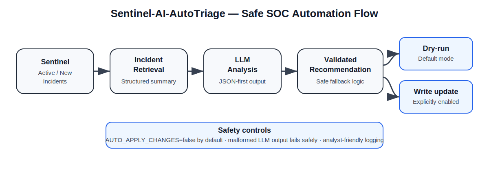

# Sentinel-AI-AutoTriage

[](https://github.com/Popoo2020/Sentinel-AI-AutoTriage/actions/workflows/ci.yml)
[](LICENSE)

**Sentinel-AI-AutoTriage** is an LLM-assisted Microsoft Sentinel triage framework for controlled SOC automation experiments.  
It retrieves active incidents, prepares structured incident context, invokes an LLM analysis layer, and supports safe response workflow development with explicit guardrails around write actions.

> **Status:** functional prototype / active hardening.  
> The project is suitable for demos, architecture discussion, and further development — not for unattended production incident closure.



## What is implemented

| Capability | Status |
|---|---|
| Azure Sentinel incident retrieval | ✅ Implemented |
| Environment-based configuration | ✅ Implemented |
| LLM client abstraction | ✅ Implemented |
| Structured JSON-first LLM parsing with safe fallback | ✅ Implemented |
| Incident status recommendation handling | ✅ Implemented |
| Write-action gate via `AUTO_APPLY_CHANGES` | ✅ Implemented |
| Console + file logging | ✅ Implemented |
| Production-grade validation, evaluation and governance | 🟡 In progress |

## Architecture

```text
Microsoft Sentinel
        │
        ▼
Incident retrieval
        │
        ▼
Structured incident summary
        │
        ▼
LLM analysis layer
        │
        ▼
Validated recommendation
        │
        ├── Dry-run logging (default)
        └── Optional incident update when explicitly enabled
```

## Safety posture

The default mode is **non-destructive**:

- `AUTO_APPLY_CHANGES=false` by default
- incident updates are logged as recommendations unless write mode is explicitly enabled
- malformed or non-JSON LLM output falls back safely to `Active / Unspecified`
- the project is designed for controlled, authorised lab or demo use

## Features

- **Sentinel incident triage flow** — fetches active/new incidents and converts them into structured summaries
- **LLM-assisted analysis** — prompts the model to return JSON with:
  - `recommended_status`
  - `classification`
  - `comment`
- **Safe parsing layer** — attempts strict JSON extraction first and degrades gracefully on malformed output
- **Write-action gate** — optional update of incident status/classification/comment only when explicitly enabled
- **Structured logging** — logs to console and `logs/auto_triage.log`
- **Extensible design** — can be expanded with confidence scoring, PII redaction, approval workflows, and richer evaluation logic

## Configuration

Required environment variables:

```bash
SUBSCRIPTION_ID=
RESOURCE_GROUP=
WORKSPACE_NAME=
OPENAI_API_KEY=
```

Optional variables:

```bash
LLM_MODEL=gpt-4o-mini
AUTO_APPLY_CHANGES=false
```

## Quickstart

```bash
git clone https://github.com/Popoo2020/Sentinel-AI-AutoTriage.git
cd Sentinel-AI-AutoTriage

python -m venv .venv
source .venv/bin/activate

pip install -r requirements.txt
python -m src.auto_triage
```

## Example LLM response contract

The analysis layer expects a JSON object shaped like:

```json
{
  "recommended_status": "Active",
  "classification": "True Positive",
  "comment": "Suspicious repeated authentication failures against a privileged account require analyst review."
}
```

## Suggested next hardening steps

1. Add redaction/sanitisation before data is sent to the LLM
2. Add confidence scoring and rule-based preconditions before any write action
3. Introduce analyst approval workflow for closure decisions
4. Add richer automated tests for parsing, malformed model output and update logic
5. Add provider adapters and a model-agnostic inference interface

## Release readiness

A sensible first tagged release would be **`v0.1.0`** once the following are verified in GitHub Actions:

- CI passes on `main`
- the README examples remain accurate
- dry-run execution is the documented default
- any optional write-action path remains explicitly gated

## Known limitations

- This is a prototype, not a production SOC platform
- It does not yet include a benchmark/evaluation suite for triage quality
- It does not yet implement PII/secret redaction before LLM invocation
- Automated incident updates should remain disabled unless tested in a controlled environment
