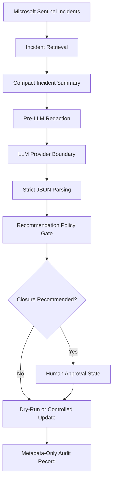

# Architecture

## Purpose

Sentinel-AI-AutoTriage demonstrates a safety-first architecture for AI-assisted security operations.

The project is designed to help analysts review incidents faster while keeping authority, write actions and closure decisions behind deterministic controls and human approval.

## High-level flow

## Core components

| Component | Purpose |
|---|---|
| `src/sentinel_client.py` | Sentinel client boundary. |
| `src/redaction.py` | Redacts common sensitive-looking values before model use. |
| `src/llm_client.py` | Handles provider abstraction, parsing and safe fallbacks. |
| `src/recommendation_policy.py` | Applies deterministic checks before status handling. |
| `src/approval.py` | Models explicit approval state for sensitive recommendations. |
| `src/audit.py` | Writes metadata-only audit records. |
| `src/auto_triage.py` | Orchestrates the triage flow. |
| `src/benchmark.py` | Runs deterministic safety-pipeline benchmark cases. |

## Design principles

1. Model output is a recommendation, not authority.
2. Dry-run mode is the default.
3. Sensitive-looking values are minimised before model use.
4. Deterministic policy checks gate the recommendation.
5. Sensitive closure paths require approval.
6. Audit records avoid raw incident text.

## Operational boundary

This is a portfolio-grade prototype for controlled review and demo use. A production deployment would require tenant-specific access design, durable approval workflow, centralised audit retention, monitoring, alerting, operational runbooks and change-management review.
