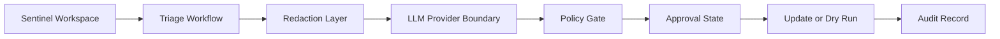

# Threat Model

## Scope

This threat model covers the portfolio prototype of Sentinel-AI-AutoTriage.

The project demonstrates how to wrap LLM-assisted incident triage with safety gates, redaction, deterministic policy and auditability.

## Assets

| Asset | Why it matters |
|---|---|
| Incident metadata | May contain operational context. |
| Incident summaries | Input to the model-assistance layer. |
| Model recommendation | Can influence analyst review. |
| Approval state | Controls sensitive closure paths. |
| Audit record | Supports accountability and review. |
| Configuration | Controls dry-run/write mode and provider settings. |

## Trust boundaries

## Key risks and controls

| Risk | Impact | Existing control | Further hardening |
|---|---|---|---|
| Sensitive data sent to model | Privacy or confidentiality issue | Pre-LLM redaction | Add enterprise DLP integration |
| Model hallucinated status | Incorrect workflow recommendation | Strict parsing and safe fallback | Add labelled evaluation dataset |
| Unsafe closure recommendation | Premature incident closure | Deterministic policy gate and approval state | Add durable analyst approval queue |
| Uncontrolled write action | Operational impact | Dry-run default and `AUTO_APPLY_CHANGES` gate | Add scoped service principal policy |
| Weak audit trail | Poor accountability | Metadata-only audit records | Centralise audit retention and monitoring |
| Provider outage or malformed output | Workflow instability | Safe fallback to active review | Add retry/backoff and provider health checks |

## Security assumptions

- Real secrets are provided through environment variables, not committed.
- Raw incident data is not stored in audit records.
- The prototype is not used for unattended production closure.
- Human review remains responsible for final decisions.

## Recommended future controls

1. Add structured configuration validation.
2. Add provider timeouts and retry/backoff.
3. Add approval integration with a ticketing or case-management workflow.
4. Add central audit logging integration.
5. Add labelled benchmark cases and measurable review metrics.
